# Are you winning, son?

This Writeup is for the reverse engineering challenge `Are you winning, son?` from IEEE-CTF, hosted by EG-CERT. 

I had a lot of fun solving this challenge, but sadly, I didn't manage to solve this challenge at the competition time.

# Solution 

First, We have a hint from the challenge that says **Check the resources it may have what you seek**.

So, Let's load the challenge into resource hacker to check the resource section. 

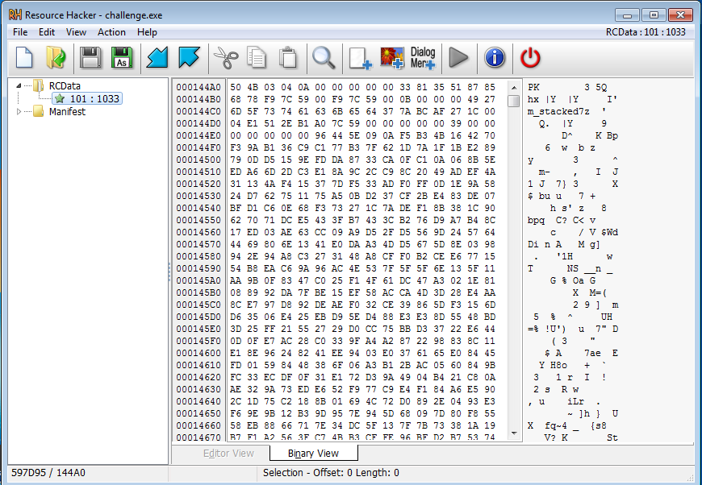

We can see the zip archive file signature, So let's save it as a zip arhive. 

When opening the zip archive, we found it contains another file called i'm stacked but sadly, it was a password-protected file.

The name of the file may gives us a hint that the password may be stored somewhere on the stack.

So, let's load the executable into ida. 

This executable is using some Anti-Debugging techniques.

We can see at the function names window there are 2 functions called `TlsCallback_0` and `TlsCallback_1`.

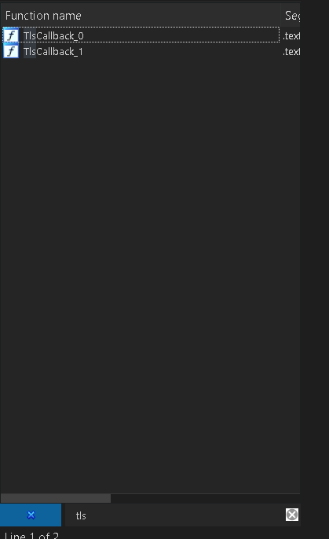


>TLS (thread local storage) calls are subroutines that are executed before the entry point. If you run the executable with a debugger, the TLS callback will be executed before the debugger breaks. This means you can perform anti-debugging checks before the debugger can do anything. Therefore, TLS callback is a very powerful anti-debugging technique.

Let's analyse them one by one. 

# TlsCallback_0 

The TlsCallBack_0 first reads the BeingDebugged field from the PEB structure which is at `fs:[30h]` and the BeingDebugged Field is 2 bytes away from the beginning of the PEB structure to check if the program is being debugged, if it's, it will end without doing any thing.

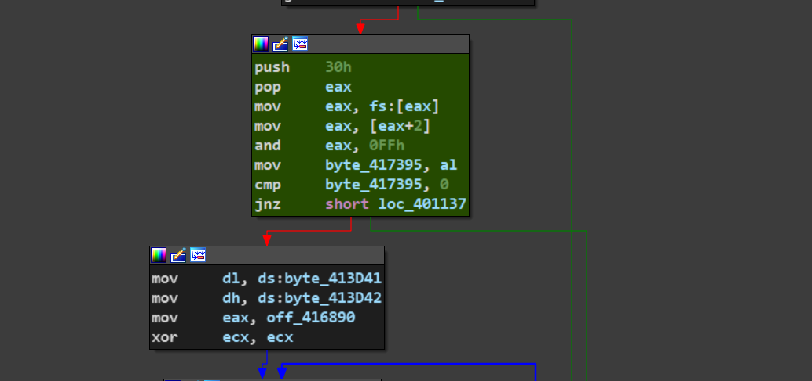

> The Process Environment Block (PEB) is a user-mode data structure that can be used by applications (and by extend by malware) to get information such as the list of loaded modules, process startup arguments, heap address, check whether program is being debugged, find image base address of imported DLLs, ...


If the program isn't being debugged, it'll take the value stored at `0x416880` which is `81 CF C4 8A CF E4 EB CF C3 EE E4 F2 B3 A3 F2 81` and xor the bytes at offsets 0,3,6,9,12 and 15 with `0xDE`.

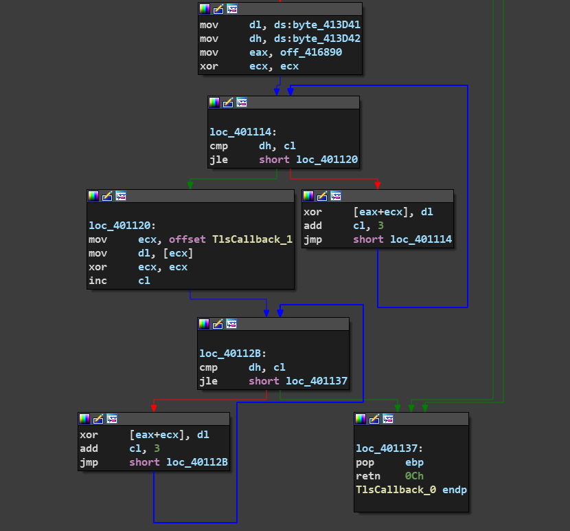
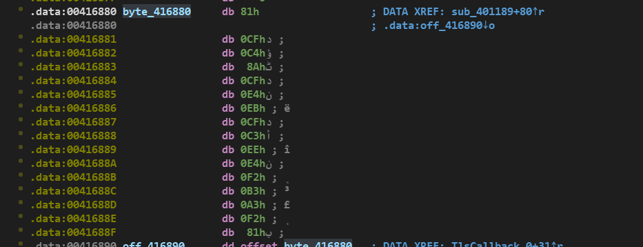


Then it'll xor the resulting value but this time the bytes at offsets 1,4,7,10,13 with 0x90 (the first byte at TlsCallback_1 which is NOP Instruction).

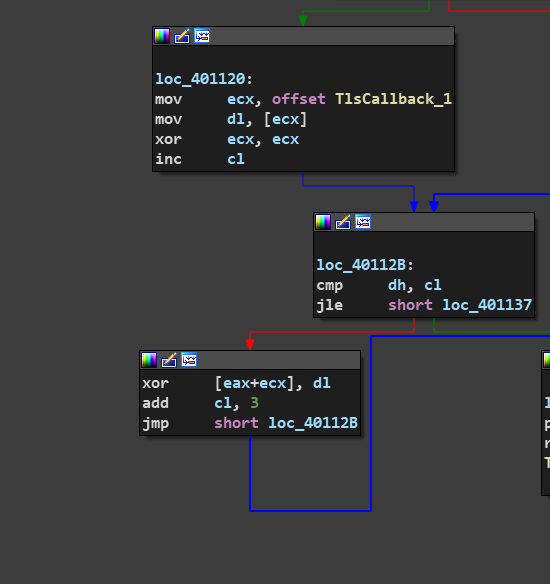

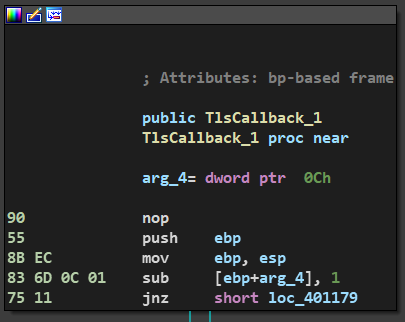

The resulting value of the 2 xor operations will be `5F 5F C4 54 5F E4 35 5F C3 30 74 F2 6D 33 F2 5F`.

# TlsCallback_1

It also checks if the program is being debugged by reading the NtGlobalFlag field from the PEB Structure.

Then it calls `sub_40113B` which also xors the previous value we got which is `5F 5F 69 54 5F E4 35 5F C3 30 74 F2 6D 33 F2 5F` with `AD` but this time the bytes at offsets `2,5,8,11,14`.

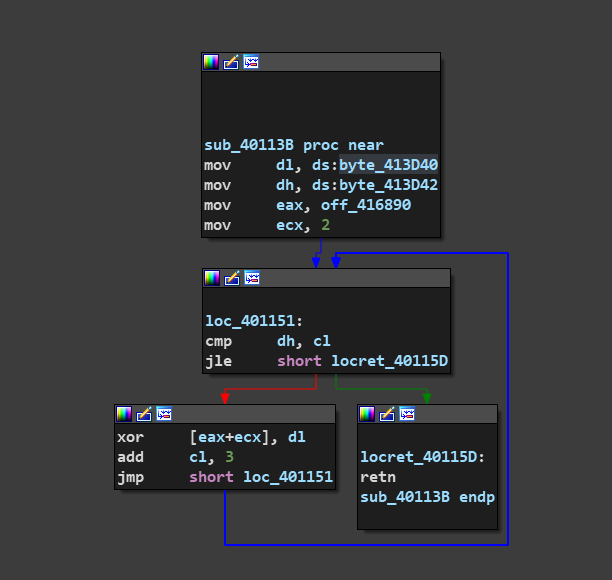

the resulting value will be `5F, 5F, 69, 54, 5F, 49, 35, 5F, 6E, 30, 74, 5F, 6D,33, 5F, 5F 
` which is `__iT_I5_n0t_m3__`  :"((((.

It seems that this isn't the right password for the archive we have, but as we say before we may conclude that the file name **I'm Stacked** is a hint for us that the password is stored on the stack ? 

After some thinking , i got an idea to have a look at the cross references of the address `00416880` where the previous string is stored to see if any function is using it.

And yeah, it was used inside a very long function at `sub_401189`.

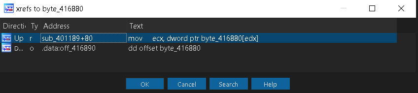


This function is doing a lot of operations with values stored on the stack, so maybe it's the function we're looking for :").


This function is called without any parameters, but before it's called, there is again a check if there is any debugger used by checking the 2 bytes `byte_417395` and `byte_417394` that where set in TlsCallback_0 and TlsCallback_1 and contains the BeingDebugged and NtGlobalFlag Values.

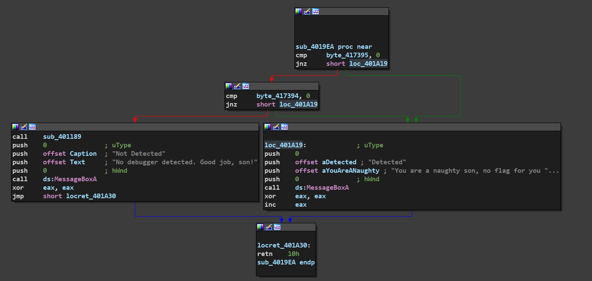


So, We need to look at the stack after this function does all its operations, but to look at the stack, we need to debug this program, And we first need to bypass the Anti-Debugging techniques used in this executable.

So, We need to bypass all the checks made in TlsCallback_0 , TlsCallback_1, and the checks that are made before calling `sub_401189` by simply setting a breakpoint at TlsCallback_0 and TlsCallback_1 before moving the values of the BeingDebugged Field and the NtGlobalFlag Field to the 2 bytes that will be checked later and change them to 0.

Note that if you're using software breakpoints and break on TLS callbacks option is enabled in your debugger, the debugger will replace the first byte of TlsCallback_1(0x90) with 0xCC (INT 3) and this value is used in TlsCallback_0 for decryption, so you have to disable the break on TLS callbacks option, or use H.W breakpoints.

After we manage to get `sub_401189` called , and after all the operations it performs, Let's take a look at the stack.

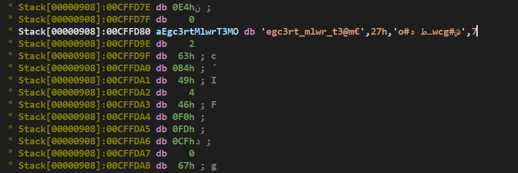

We finally got the password **egc3rt_mlwr_t3@m** .


After extracting the 7z archive we got another archive `d4d.7z` and another executable `dad's_secret_mailbox`.

The archive is password-protected and contains a gif. 

So we also need to find out what is the password for that archive.

Checking that executable, i found that it's packed with VMProtect.

And when running it, this message is displayed : `What is your approach when static analysis becomes a dead-end` and then another message : `How would you save a file before it's deleted`.

Obviously, this executable is dropping some files and deletes them immediately.

let's use procmon to see what files are dropped.

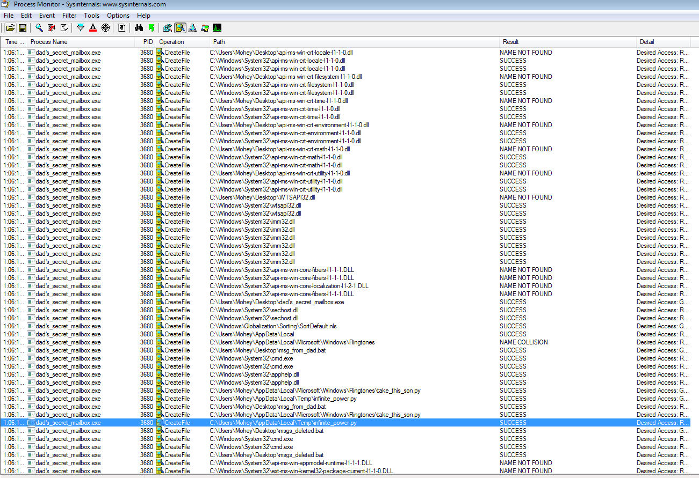

it drops the following files: 
- infinite_power.py
- take_this_son.py
- msg_from_dad.bat 
- msgs_deleted.bat

So, How we can get these files before they are deleted..... because the process takes some time before deleting the files we can just copy them to another location before being deleted, or we can supsend the process. 

The only important file i found is infinite_power.py which contains the following script.

```python
# Remeber, son!
# My passwords always start with "d4d" (without the quotes)
"".join([chr((ord(i)^(decryption_key&0xFF))) for i in'z*zA*ri*gmA-p}lgnjmAv/mAz*j*?^=:'])

```

Whatever the value of the decryption key , it will just take the lower byte of it, because of the anding operatin with 0xFF, so the value `(decryption_key&0xFF)` could only be from 0 to 255 which is 0x00 to 0xFF, and we have a hint that the password starts with `d4d`.

So, we can try all the possible values between 0 to 255 until we got the password.


```python
for num in range(256):

      flag = "".join([chr((ord(i)^num)) for i in'z*zA*ri*gmA-p}lgnjmAv/mAz*j*?^=:'])

      if "d4d" in flag:
            print(flag)


#output : d4d_4lw4ys_3ncrypts_h1s_d4t4!@#$

```

We got the right password `d4d_4lw4ys_3ncrypts_h1s_d4t4!@#$`.

After extracting the archive , We got this gif image.


The flag is displayed but at a very high speed. 

Using this website to slow the gif : [ezgif](https://ezgif.com/speed).

We finally got the flag : **flag{r3v3rs3_3ng_sk1llz}**


